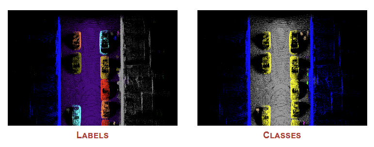
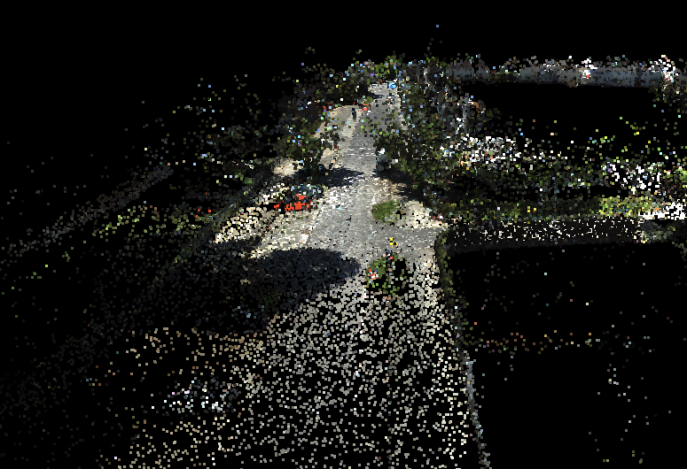
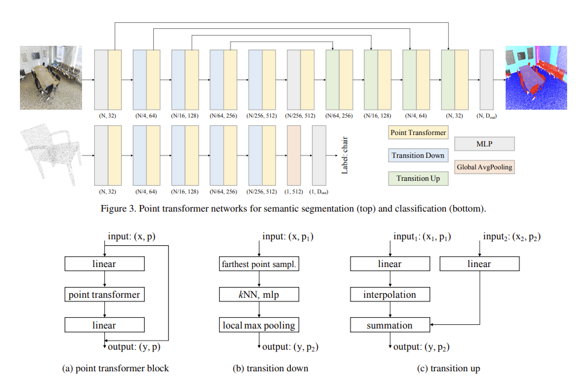
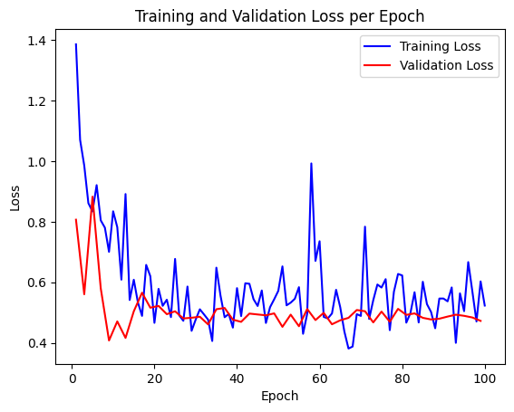
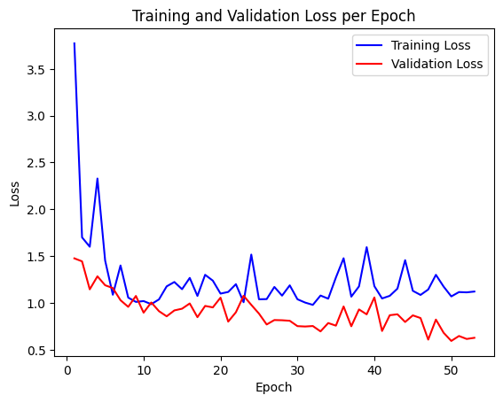
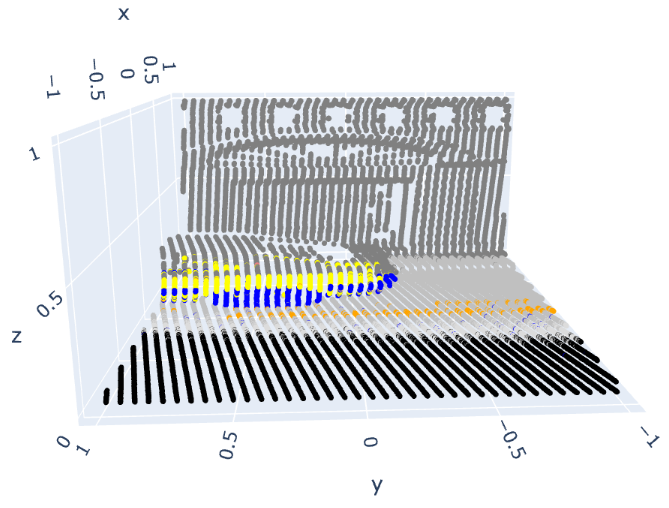
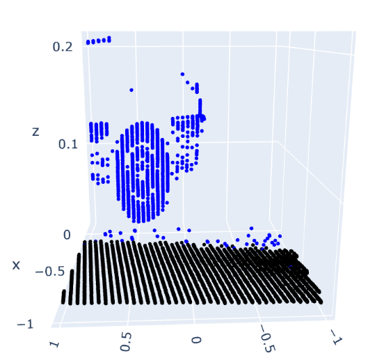
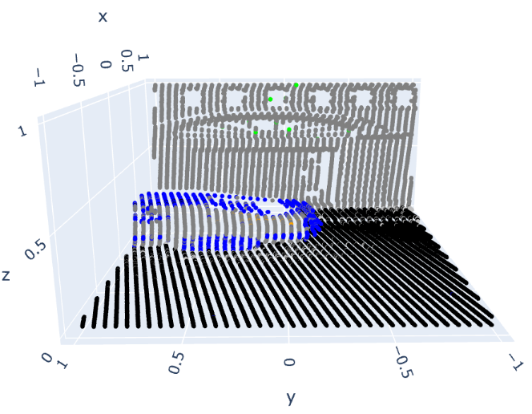

# Semantic Segmentation 3D

This repository contains the final project developed for the [*Artificial Intelligence with Deep Learning*](https://www.talent.upc.edu/ing/estudis/formacio/curs/310400/postgraduate-course-artificial-intelligence-deep-learning/) postgraduate course taught at [Universitat Politècnica de Catalunya](https://www.upc.edu/en).

The developers are [**Arnau Ruana**](https://github.com/arnauruana), [**Rafel Palomo**](https://github.com/RafelPalomo) and [**Soraya Gonzalez**](https://github.com/SorayaGonzalezSanchez). Being [**Mariona Carós**](https://github.com/marionacaros) the advisor of the project.

## Table of Contents

* [Introduction](#introduction)
* [Motivation](#motivation)
* [Datasets](#datasets)
  * [DublinCity](#dublincity)
  * [UrbanDense](#urbandense)
  * [KITTI-360](#kitti-360)
* [Models](#models)
  * [PointNet](#pointnet)
  * [PointTransformer](#pointtransformer)
  * [DynamicGraphCNN](#dynamicgraphcnn)
* [Implementation](#implementation)
* [Results](#results)
* [Conclusions](#conclusions)

## Introduction

3D Semantic Segmentation is a [computer vision](https://www.ibm.com/topics/computer-vision) task that involves dividing a 3D point cloud or 3D mesh into semantically meaningful parts or regions. Its goal is to identify and label different objects and parts within a 3D scene, which can be very useful for applications such as [robotics](https://en.wikipedia.org/wiki/Robotics), [autonomous driving](https://en.wikipedia.org/wiki/Vehicular_automation), and [augmented reality](https://en.wikipedia.org/wiki/Augmented_reality).

  

The main objective of this project is to create a [deep learning](https://en.wikipedia.org/wiki/Deep_learning) model able to perform [semantic segmentation](https://paperswithcode.com/task/semantic-segmentation) over a given [point cloud](https://en.wikipedia.org/wiki/Point_cloud).

To achieve this, we are going to explore some state-of-the-art techniques and apply them to the field of 3D data analysis. As we will see throughout this document, by leveraging the power of Deep Learning models, we can extract meaningful information from 3D data.

The outcome will be two solid models of Semantic Segmentation with the understanding of urban scenes. The model will be trained and evaluated on specific datasets, which will allow reproducibility and comparability of the results.

## Motivation

The motivation behind this project stems from the growing importance of 3D data analysis and understanding. With the advancements in 3D sensing technologies such as [LiDAR](https://www.ibm.com/topics/lidar) (Light Detection and Ranging), there is a wealth of 3D data available in various domains, including robotics, geo-spatial analysis, and computer vision.

LiDAR is a remote sensing technology that uses lasers to measure distances and create detailed 3D maps of objects and environments. It works by emitting laser pulses, measuring the time it takes for the light to bounce back, and converting it into distance measurements.

  

Semantic Segmentation of 3D data plays a crucial role in extracting valuable insights and enabling intelligent decision-making. Accurate and efficient segmentation techniques can help identify objects, classify different regions, and understand the spatial structure of the environment.

Due to all of this, by working on this project, we aim to understand and acquire some experience in this interesting computer vision field since it has been a very briefly explained topic in class unfortunately.

## Datasets

We have been exploring different types of 3D datasets to train our models. The most significant ones are detailed below.

### DublinCity

First of all we tried to use the [Dublin City dataset](https://v-sense.scss.tcd.ie/dublincity/). This dataset consists of approximately 260 million labeled points out of a total of 1.4 billion points. The selected area within the dataset represents various types of historic and modern urban elements, including different types of buildings such as offices, shops, libraries, and residential houses.

  

This dataset contains annotations for urban elements categorized into 13 classes at three levels of detail. At Level 1, the coarse labeling consists of four classes: Building, Ground, Vegetation, and Undefined. Buildings encompass various habitable urban structures, while Ground includes terrain elevation points. Vegetation covers all separable plant types, and Undefined represents less significant urban elements such as bins, decorative sculptures, cars, and more. Level 2 refines the categories from the previous level, dividing Buildings into roof and facade, Vegetation into trees and bushes, and Ground into street, sidewalk, and grass. Level 3 further includes annotations for doors, windows and more.

  

Unfortunately, despite how good this dataset looked, we had several problems that lead us to abandon it. Specifically, the most relevant one was the fact of not being able to obtain the labels properly. Nor being able of manipulating or visualizing them. Maybe, it was some problem related with the program we used for exporting them: [CloudCompare](https://www.cloudcompare.org/).

### UrbanDense

Another dataset we came across on the internet was called [IQmulus & TerraMobilita Contest](http://data.ign.fr/benchmarks/UrbanAnalysis/). This one was pretty humble, compared to the hugeness of the others, as it is composed of approximately $300$ million points, of which $12$ million are labelled. It is a public dataset containing a point cloud from a $200$ meter street in Paris, gathered using the LiDAR technology. The points are labeled with their respective classes and identifiers, making it suitable for either [Semantic Segmentation](https://paperswithcode.com/task/semantic-segmentation) or [Instance Segmentation](https://paperswithcode.com/task/instance-segmentation) tasks.

  

The point coordinates are geo-referenced in the [Lambert-93](https://epsg.io/2154) and the reflectance attribute represents the laser intensity. Each point in the dataset also has the semantic class, the object instance and the number of echos. Check out the official website linked above for more information about all of them.

This dataset was the one used for training our models throughout the entire project. We found it very understandable and it worked almost perfectly from the first time in our machines. We also consider it's a very good dataset for academic purposes as we can handle the data and understand it. Due to these reasons, we decided to use this dataset as we started moving deeper into this three-dimensional world.

### KITTI-360

On the other hand, during development, we also discovered this wonderful and gigantic dataset called [KITTI-360](https://www.cvlibs.net/datasets/kitti-360/)
which we would have loved to use if we hadn't had everything adapted for the previous one. Against it, we must point out that is insanely huge (~$24$ GB), therefore the resources needed in order to run it decently fast, would have become practically unattainable taking into account the project's schedule and remaining days. Having considered that it was outside the scope of our project, we decided to keep using the [UrbanDense](#urbandense) for our training tasks.

  

This widely-known dataset, is a large-scale collection of sensory information and annotations. It consists of over $320.000$ images and $100.000$ laser scans, covering several suburbs of Karlsruhe, Germany. The dataset encompasses a driving distance of $73.7$ kilometers. The annotations provided include both static and dynamic 3D scene elements, which are transferred into the image domain. The dataset also employs a consistent semantic label definition with Cityscapes, comprising $19$ classes for evaluation purposes.

Despite we haven't used it for training purposes as we have said, we did actually download some parts and plot them to realize how good this dataset is. One of its interesting features is that, somehow, merges point cloud data with image data to achieve RGB features for the points. This should be very useful when training because the model not only learns how are the points distributed but also it learns additional information such as their colors in the real world, adding the RGB dimension to the problem.

  

## Models

Similarly to the [previous](#datasets) state-of-the-art task of exploring suitable datasets, we had to investigate which are the most significant and relevant models out there worth taking a look. After some research, we found three main different models.

### PointNet

[PointNet](https://arxiv.org/pdf/1612.00593.pdf) is the first deep learning model designed for 3D raw point cloud understanding. It was proposed in 2017 and has been widely used for various tasks in 3D computer vision, such as object recognition, segmentation, and scene understanding. The main idea behind it is to directly process the unordered and unstructured point cloud data without the need for pre-defined voxelization or handcrafted features. This makes PointNet a versatile and flexible model for handling different types of point cloud inputs.

  

The architecture consists of two main modules: a shared Multi-Layer Perceptron ([MLP](https://deepai.org/machine-learning-glossary-and-terms/multilayer-perceptron)) network and a symmetric function called the "[max pooling](https://deepai.org/machine-learning-glossary-and-terms/max-pooling)" operation. The MLP network is responsible for processing each individual point independently and learning local point features. It takes as input the coordinates (x, y, z) of each point. Any other additional attributes associated with the points, such as color or intensity, are concatenated afterwards (behind the "input transform" block).

The max pooling operation aggregates the local features and produces a global feature vector that summarizes the entire point cloud. This operation is invariant to the order of points and ensures that the network can handle point clouds with varying numbers of points. The output of the max pooling operation is then fed into another MLP network for further classification processing (blue part) or concatenated with the local point information for segmentation purposes (yellow part).

  

The T-Net (Transformation Network) is an essential component of the PointNet model. It is used to learn and apply geometric transformations to the input point cloud, allowing PointNet to handle different spatial orientations and alignments of the 3D data. It is a small network module that predicts a 3x3 transformation matrix for each input point cloud. This matrix represents the rotation and translation required to align the points to a canonical coordinate system. By incorporating the T-Net, PointNet can effectively learn to align the input point clouds before processing them further. This alignment helps in achieving invariance to the input's initial orientation, which is crucial for tasks involving 3D point clouds

  

During training, PointNet uses a loss function, such as [cross-entropy](https://en.wikipedia.org/wiki/Cross_entropy) loss for classification or intersection over union ([IoU](https://pyimagesearch.com/2016/11/07/intersection-over-union-iou-for-object-detection/)) loss for segmentation, to optimize the network parameters. The network learns to extract discriminative features from the point cloud data and make predictions based on these features.

PointNet has demonstrated impressive performance on various 3D point cloud understanding tasks and has been extended in subsequent works to handle larger point clouds, handle local geometric structures, and incorporate contextual information. It has significantly advanced the field of 3D computer vision by providing a powerful and flexible model for processing raw point cloud data. It has also evolved into an enhanced version of itself called **PointNet++**. Check out its [paper](https://arxiv.org/pdf/1706.02413.pdf) for further information

We found it interesting to start from scratch using this model to understand the basics of 3D raw point-cloud processing and pay tribute to the network that pioneered this world.

### PointTransformer

PointTransformer is another deep learning model designed for 3D point cloud understanding. It builds upon the success of [Transformers](https://deepai.org/machine-learning-glossary-and-terms/transformer-neural-network), originally introduced for sequence tasks in [natural language processing](https://www.ibm.com/topics/natural-language-processing). PointTransformer extends the Transformer architecture to effectively process unordered and unstructured point cloud data. Its main idea is to take advantage of the self-attention mechanism of Transformers to capture relationships between points in the point cloud. This allows the model to learn long-range dependencies and context information, leading to improved performance in comparison with the [PointNet](#pointnet), explained before.

  

The PointTransformer architecture consists of three main components: a position encoding module, a set transformer, and a multi-head self-attention mechanism. The position encoding module encodes the positional information of each point in the input point cloud. It ensures that the model can distinguish between different points and consider their relative positions during the self-attention process. The set transformer is responsible for aggregating information from individual points and producing a global representation of the entire point cloud. It consists of multiple layers, each performing a self-attention operation followed by a feed-forward neural network. The self-attention mechanism in PointTransformer allows each point to attend to all other points in the cloud, capturing their contextual relationships. It enables the model to learn important features and interactions between points, regardless of their spatial order or proximity. The multi-head self-attention mechanism further enhances the model's ability to capture diverse and complex relationships in the point cloud. It splits the self-attention operation into multiple parallel heads, allowing the model to attend to different aspects of the data simultaneously.

  

We were about to use this model, if it had not been for the complication of compiling some of its parts that were written in C++ for efficiency reasons. We tried to compile them but some compilation errors raised even though all the requirements were met. Finally we decided to try something else, fully written in Python, to avoid significant loss of time that could affect the development of the project.

### DynamicGraphCNN

Dynamic Graph Convolutional Neural Network (abbreviated as GraphNet in the project) is a model used for graph-based data, where the data is represented as a [graph](https://en.wikipedia.org/wiki/Graph_(discrete_mathematics)) with nodes and edges. It extends the traditional Convolutional Neural Network (CNN) to handle data with varying graph structures or changing over time. The key idea behind DynamicGraphCNN is to dynamically construct a graph representation based on the input data, rather than using a fixed or predefined graph structure. This allows the model to capture the inherent relationships and dependencies between different elements in the data.

  

The model consists of two main components:

* **Graph Construction Module**: This module takes the input data and constructs a graph representation. It determines the nodes of the graph based on the data elements and defines the edges based on the relationships between the elements. The construction process can be adaptive, considering the characteristics of the data or the task at hand.

* **Graph Convolutional Module**: Once the graph is constructed, the graph convolutional module performs convolutions on the graph structure. It applies convolutional operations to the nodes and their neighboring nodes in the graph, allowing the model to learn and extract meaningful features from the data while capturing both local and global contextual information.

  

Overall, DynamicGraphCNN combines the power of graph-based representations with the flexibility of dynamically constructed graphs, enabling effective learning and inference on graph-structured data. Upon understanding it, we thought it made much more sense as it better captures the geometric shapes between objects and decided to give it a try as a second model to experiment with.

## Implementation

To ensure an organized and manageable codebase, the project follows a specific directory structure. This section provides an overview of the main directories and their purposes, as well as the meaning of the most significant file and its implementations.

### .vscode/

Special folder where VSCode related stuff must go, such as workspace [configurations](../.vscode/settings.json) or recommended [extensions](../.vscode/extensions.json). Useful for code standardization purposes.

### assets/

Contains [images](../assets/) used for documentation purposes with markdown.

### config/

This directory contains only the [class weights](../config/) used for balancing the loss calculation when a huge class imbalance is present.

### data/

When downloaded, it contains all the [splits](../data/) of point clouds used as dataset for the project.

### doc/

Folder to store all the [documentation](./) related files.

### model/

When downloaded, it contains both final pre-trained [models](../model/) (`pointnet` and `graphnet`). Otherwise, it will contain temporal models that are still training.

### plot/

Here is where the [plots](../plot/) are going to be saved by default. Remember you need to plot something in order to generate the directory.

### src/

This is where all the python [source code](../) is located. It contains two modules and some common utility files.

#### pointcloud.py

This is the main utility class used across the entire development. It provides functionality for working with [point cloud](../src/pointcloud.py) data. It inherits from a `torch.Tensor` class but extends it to fit our necessities and facilitate our work.

It can retrieve valuable information about point clouds (coordinates, features, labels...), shuffle point clouds, rotate them, random sampling them and even plotting the points.

#### split.py

This [file](../src/split.py) is used to divide the dataset into small point clouds of 2 meters.

#### utils.py

This other [file](../src/utils.py) contains utilities and global variables used in the project.

### pointnet

The [PointNet](../src/pointnet/) module encompasses all the files needed for PointNet training, testing or inferencing. It also contains its respective model and dataset required and modified for our convenience.

### graphnet

Similarly to the previous module, this one contains the exact same files but, all of them, adapted for the [GraphNet](../src/graphnet/) version.

## Results

In this section, we will discuss the evaluations and assessments conducted on the project and present the outcomes obtained. Throughout the development process, various evaluations and tests were performed to assess the performance, accuracy, and efficiency of the project's components.

In terms of results, we conducted evaluations on both PointNet and GraphNet models. The accuracy (ACC) and Intersection over Union (IoU) were used as performance metrics.

|     Model    | Accuracy (ACC) | Intersection over Union (IoU) |
|:------------:|:--------------:|:-----------------------------:|
| **PointNet** | 0.8803         | 0.8423                        |
| **Graphnet** | 0.8573         | 0.7818                        |

### PointNet

For the PointNet model, we achieved an accuracy of $0.88$ and an IoU of $0.84$. This indicates that the model performs well enough in accurately classifying and segmenting the point cloud data.

  

### GraphNet

On the other hand, the GraphNet model achieved a slightly lower accuracy of $0.85$ and an IoU of $0.78$. While the GraphNet model is slightly less accurate than PointNet, it still demonstrates quite reasonable performance.

  

### Discussion of the results

These results showcase the effectiveness of both PointNet and GraphNet models in semantic segmentation 3D tasks. However, it is important to note that the dataset used for training and evaluation suffers from class imbalance. This means that certain classes within the dataset have significantly fewer samples compared to others. As a result, the models may struggle to learn and accurately classify the minority classes, leading to lower performance for those ones.

In order to provide a visual understanding of the models' performance, several example images from different splits will be showcased. These images will include the ground truth annotations as well as the predictions generated by both models. The comparison between the ground truth and predictions will offer insights into the models' ability to accurately segment the point cloud data.

#### Ground truth

  
  

#### PointNet

  
  

#### GraphNet

  
  

Overall, as we can infer from the results, the GraphNet, despite having less accurate metrics, performs better in real world scenarios than PointNet as it learns the relationships between near points. In the last image, for example, we can see how good the car has been recognized by its edges while the intermediate points of it aren't present.

## Conclusions

### Challenges

During the course of the project, we encountered several challenges that required careful consideration and problem-solving.

One of the primary challenges we faced during the project was the selection of an appropriate dataset. We encountered the following obstacles in this process:

* **Limited availability**: initially, we struggled to find a dataset that provided easily exportable point cloud data. Some datasets only offered images without the corresponding point cloud information, which hindered our ability to work with 3D data effectively.
* **Binary data format**: we came across a dataset that stored its data in a binary format, which required additional effort to develop custom methods for data extraction and processing.
* **Incomplete annotations**: another challenge we encountered was a dataset with incomplete or inaccurately annotated class labels. This posed difficulties during the training and evaluation phases, as reliable ground truth annotations are crucial for model development and performance assessment.

In addition, the computational requirements for the training stage were extremely high. We had to invest in powerful hardware resources to ensure efficient training of our models. This presented a significant challenge in terms of cost and infrastructure setup.

Another challenge was that We had to learn to treat data structures that were not covered in class. This involved understanding various data architectures, working with point clouds and graphs, performing transformations, and plotting 3D data for analysis and visualization purposes.

### What we have learned

Throughout the project, we gained valuable insights and knowledge on several important aspects:

* **Importance of quality data**: the success of any machine learning project heavily relies on the quality of the data used for training and evaluation.
* **Importance of using the right model**: choosing an appropriate model architecture is crucial for achieving accurate and reliable results.
* **Data preprocessing and normalization**: proper preprocessing and normalization techniques are essential for improving the performance of machine learning models.
* **Hyperparameter optimization**: optimizing the hyperparameters of the models can significantly impact their performance and effectiveness.
* **Evaluation and performance metrics**: selecting appropriate evaluation metrics and accurately assessing model performance are vital for making informed decisions.
* **Understanding PointCloud architectures**: we gained an understanding of how PointCloud architectures work and their application in our project.
* **Efficient utilization of available hardware**: managing and utilizing the available hardware resources efficiently is essential for training models effectively and minimizing costs.

In conclusion, our project has demonstrated the potential of semantic segmentation on 3D point clouds and its impact on various domains. Despite the challenges faced, we successfully addressed them. We are quite proud of our achievements and look forward to continue learning about this wonderful field.
